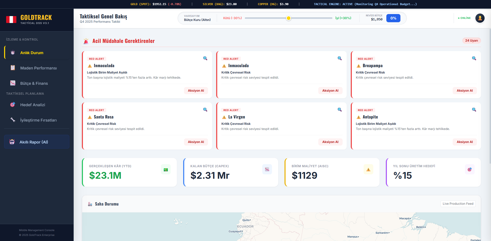
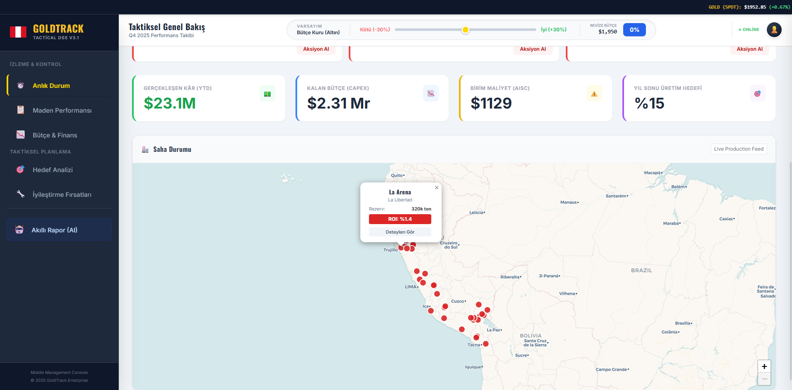
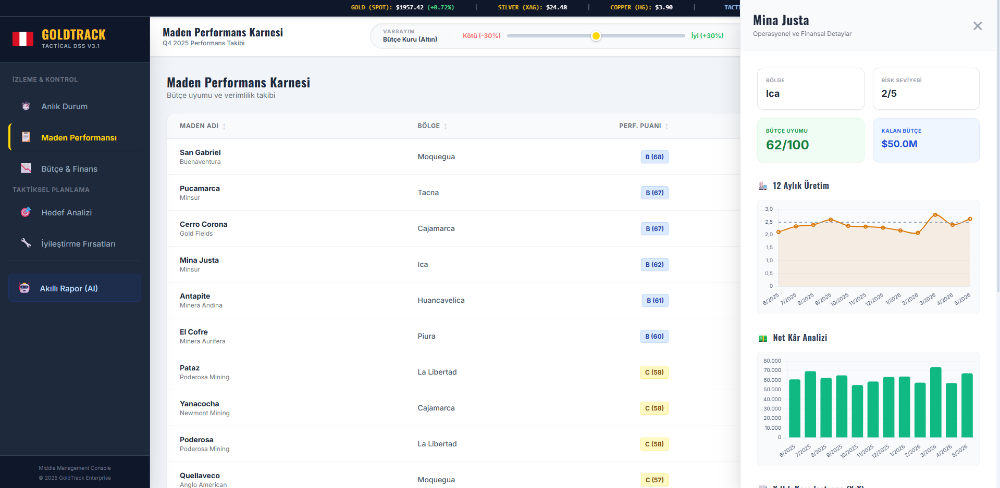
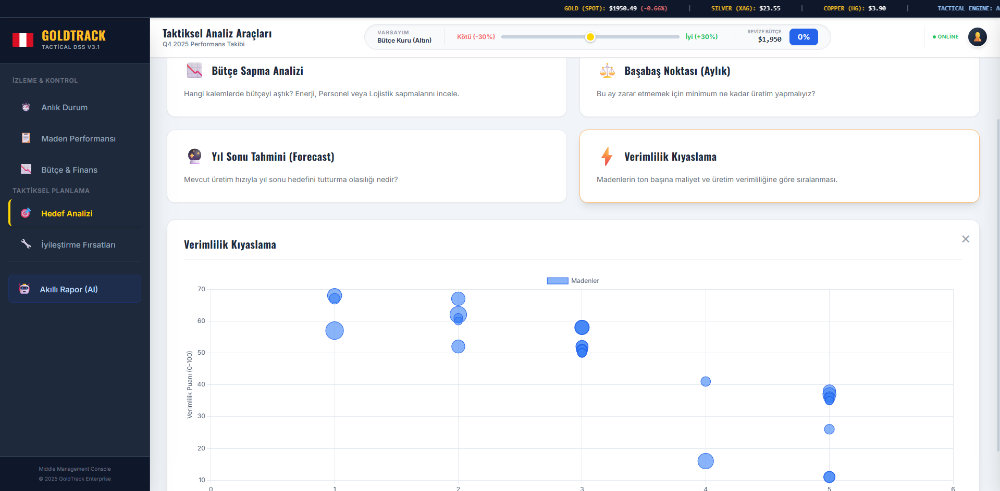
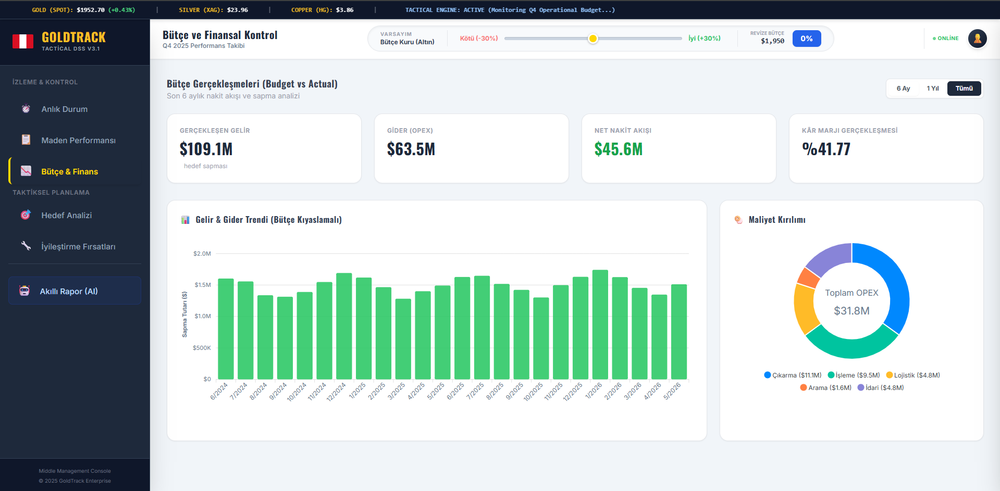

# ⛏️ GoldTrack PE — Taktiksel Karar Destek Sistemi

Peru altın madenciliği operasyonları için geliştirilmiş taktiksel seviyede Karar Destek Sistemi

---

## 📌 Proje Hakkında

GoldTrack PE, Peru genelindeki **39 aktif altın madenini** tek bir portföy olarak izleyen hibrit bir Karar Destek Sistemi'dir. Orta ve üst düzey yöneticilere **6–12 aylık planlama ufkunda** veri odaklı taktiksel kararlar aldırır. Hem **veri güdümlü** hem de **model güdümlü** analitik yetenekleri bir arada sunar.

---

## 🖥️ Ekran Görüntüleri

### Taktiksel Genel Bakış

### Saha Haritası

### Maden Performans Karnesi

### Taktiksel Analiz Araçları

### Bütçe ve Finansal Kontrol

---

## ✨ Temel Özellikler

- 🚨 **Kural Tabanlı Uyarı Motoru** — 6 farklı kural ile otomatik KIRMIZI / SARI / MAVİ uyarı
- 📊 **Maden Performans Karnesi** — A/B/C/D derecelendirme sistemi (0–100 puan)
- 💰 **Bütçe ve Finansal Kontrol** — Sapma analizi ve OPEX maliyet dağılımı
- 🗺️ **İnteraktif Saha Haritası** — ROI bazlı renk kodlamalı Leaflet.js haritası
- 📈 **Taktiksel Analiz Araçları** — Bütçe Sapma, Başa Baş Noktası, Üretim Tahmini, Kıyaslama
- 🤖 **Yapay Zeka Taktiksel Rapor** — Otomatik yönetici özeti + PDF dışa aktarım
- 🔄 **Karar Denetim İzi** — Alınan kararların 90 gün sonra otomatik değerlendirilmesi
- 💡 **Altın Fiyatı Senaryo Simülasyonu** — ±%30 aralığında anlık etki analizi

---

## 🔧 Performans Puanlama Algoritması

Her maden için **bileşik puanlama modeli** (0–100):

| Bileşen | Ağırlık | Açıklama |
|---------|---------|----------|
| AISC Verimliliği | 40 puan | Düşük maliyet = yüksek puan |
| ROI Performansı | 30 puan | Yatırım getirisi oranı |
| Risk Profili | 30 puan | Çevresel risk seviyesiyle ters orantılı |

Dereceler: **A** (≥80) · **B** (≥60) · **C** (≥40) · **D** (<40)

---

## 🛠️ Teknoloji Yığını

| Katman | Teknoloji |
|--------|-----------|
| Arayüz | HTML5 + Vanilla JS + TailwindCSS |
| Grafikler | Chart.js + ApexCharts + Leaflet.js |
| Sunucu | Node.js + Express.js |
| PDF Dışa Aktarım | jsPDF + html2canvas |
